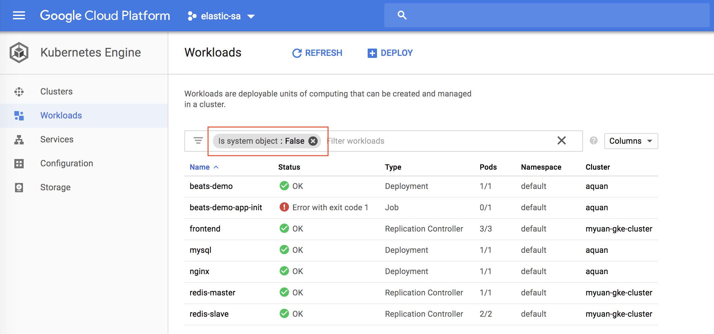
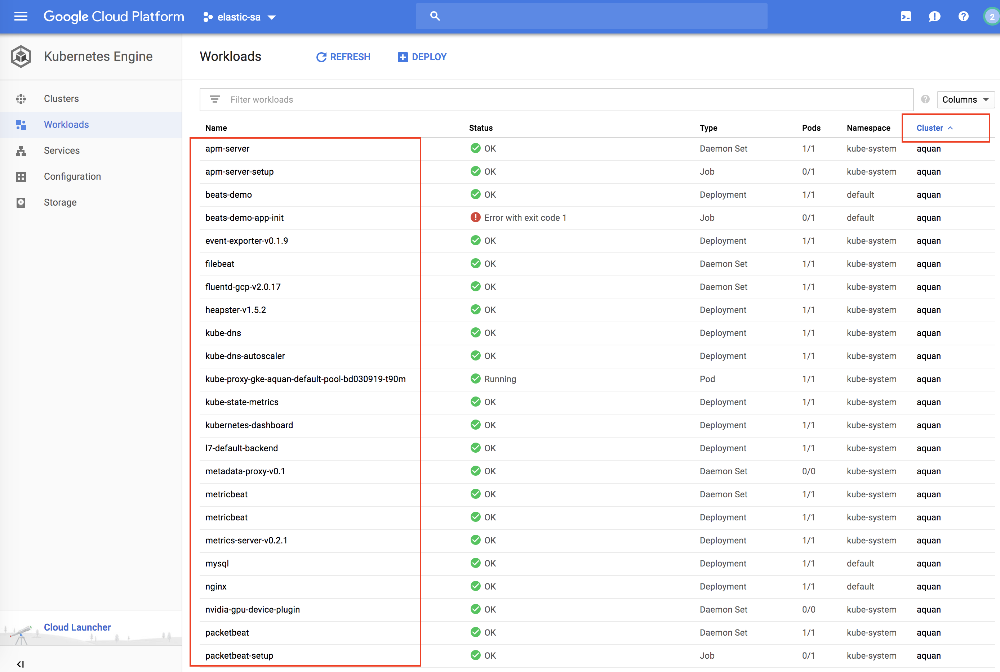
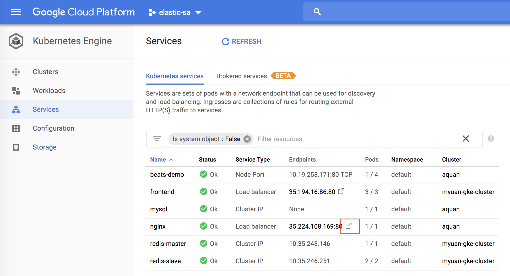
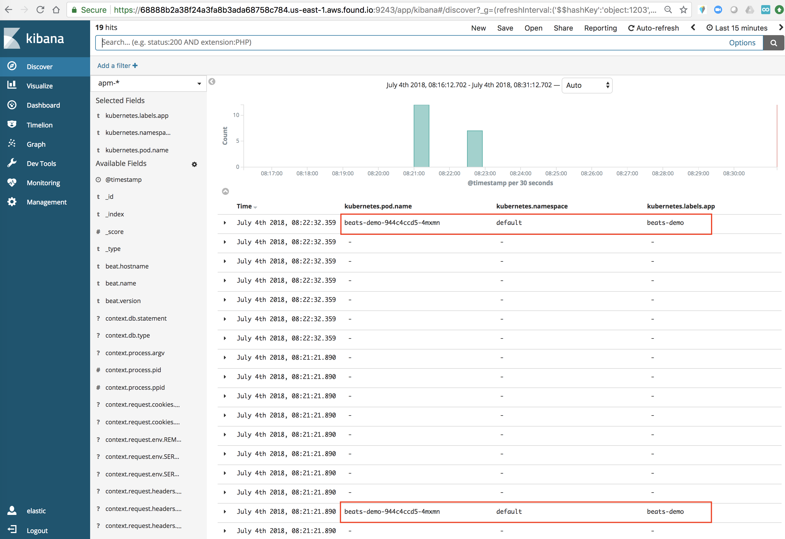

# Oberservable Kuberentes demo using Beats and APM in GCP

We are going to deploy a Python demo application with MySQL backend and Nginx frontend monitored by Filebeat, Metricbeat, Packetbeat and APM into GKE in GCP. Elasticsearch and Kibana are hosted in Elastic Cloud.

### Create an Elastic Cloud deployment
We will use Elastic Cloud ( http://cloud.elastic.co ) . Don't worry, you do not need a credit card.

1. Go to https://www.elastic.co/cloud/elasticsearch-service/signup
2. Click on Start Free Trial


3. Check your email and click on the link in the email
4. Set your password when prompted. 

### Get Started with GKE

1. Create a K8s cluster on GCP Kubernetes Engine.  Ensure to provide a name and select a zone.  Take the default for the rest.


2. [Install Google Cloud SDK](https://cloud.google.com/sdk/install)
3. [Install and setup kubectl](https://kubernetes.io/docs/tasks/tools/install-kubectl/)
4. Setup your local environment

```
gcloud config set project <PROJECT_NAME>
gcloud config set compute/zone <DEFAULT_ZONE>
gcloud config set container/cluster <CLUSTER_NAME>
gcloud auth login
```
To verify if the values are set properly, `gcloud config get-value <PROPERTY_NAME>`

5. Update credentials and endpoint information to point kubectl at a specific cluster in Google Kubernetes Engine

```gcloud container clusters get-credentials <CLUSTER_NAME> --zone <DEFAULT_ZONE> --project <PROJECT_NAME>```

By default, the credentials are written to `HOME/.kube/config`  For details, please see (https://cloud.google.com/sdk/gcloud/reference/container/clusters/get-credentials)

6. Create a cluster level role binding so you can edit system level namespace.

```kubectl create clusterrolebinding cluster-admin-binding  --clusterrole=cluster-admin --user=<USER_NAME>```

Usually, <USER_NAME> is the email address of the user.

7. To workaround [this issue](https://coreos.com/operators/prometheus/docs/latest/troubleshooting.html)

```
kubectl create clusterrolebinding sherry.ger-cluster-admin-binding --clusterrole=cluster-admin --user=sherry.ger@elastic.co 
```

If you are successful, you should see the following output

```clusterrolebinding.rbac.authorization.k8s.io "sherry.ger-cluster-admin-binding" created```


5. Change the secretes in the secretes.yaml file to point to your Elastic Cloud Elasticsearch cluster. Make sure you change the host name of the Elasticsearch host and Kibana host to point to your own Elastic Cloud instance. Remember to use the '-n' option during encoding.

```
echo -n 'STRING-TO-ENCODE' | base64
```

6. Deploy everyting using the following command. Wait a few minutes for all the deployments to be done.

```
kubectl apply -f .
```

7. Go to "Workloads" from your GKE console, you should see the list of deployments. You can get ride of the system filter to see all deployments.



This is a list of all of my deployments without the system filter. Make sure you see everthing is up running and healthy.



8. Go to "Services", and click on the icon next to the IP of the nginx service, the application web page should be open.



Here is how the application look like. You can click on "add a new question" link to add a new question, which will be saved into the mysql database.


Fill in a question and your name and click on submit. This will generate some traffic. Feel free to add more questions and click around.


9. Go to your Elastic Cloud Kibana console. Open the "Metricbeat Kuberenetes" dashboard. You should see something like this.


Feel free to explore other dashboards by searching them.


Here is the "Filebeat MySQL" dashboard.


Here is the "APM Transaction" dashboard.


Keep in mind that we do not have APM in the cloud yet. So, you do not see the APM UI from Kibana. However, if you are sending all these data to a local 6.3 cluster, you will have the APM UI.

10. Finally, go to "Discover" and select the "apm-*" index pattern. Notice that some of the entries are tagged with Kubernetes metadata? This is extremly powerful for correlating APM data with Kubernetes infrastructure. Right now, we are achieving this by deploying the APM server as a DamonSet inside Kuberentes. In the future, we will be adding "native" ways to add these metadata.




