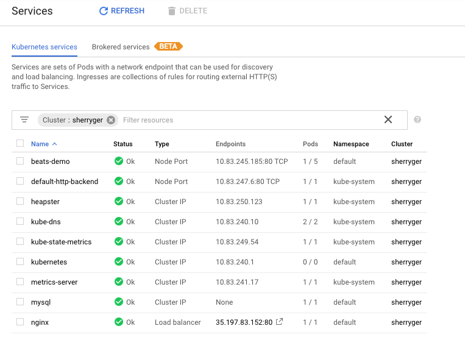

# Oberservable Kuberentes demo using Beats and APM in GCP

We are going to deploy a Python demo application with MySQL backend and Nginx frontend monitored by Filebeat, Metricbeat, Packetbeat and APM into GKE in GCP. Elasticsearch and Kibana are hosted in Elastic Cloud.

### Create an Elastic Cloud deployment

We will use [Elastic Cloud](http://cloud.elastic.co). Don't worry, you do not need a credit card.

1. Go to https://www.elastic.co/cloud/elasticsearch-service/signup
2. Click on Start Free Trial


3. Check your email and click on the link in the email
4. Set your password when prompted
5. Login to Elastic Cloud console (https://cloud.elastic.co)
6. Click on the Create deployment button
7. Add a name to your cluster and select a cloud platform, a region, and a deployment template for your cluster 


8. Customize your deployment. As of March 2019, you can deploy a cluster upto across 2 zones with 8GB of RAM per zone for a trial.


### Get Started with GKE

1. Create a K8s cluster on GCP Kubernetes Engine.  Ensure to provide a name and select a zone.  Take the default for the rest.


2. [Install Google Cloud SDK](https://cloud.google.com/sdk/install)
3. [Install and setup kubectl](https://kubernetes.io/docs/tasks/tools/install-kubectl/)
4. Setup your local environment

```
gcloud config set project <PROJECT_NAME>
gcloud config set compute/zone <DEFAULT_ZONE>
gcloud config set container/cluster <CLUSTER_NAME>
gcloud auth login
```
To verify if the values are set properly, `gcloud config get-value <PROPERTY_NAME>`

5. Update credentials and endpoint information to point kubectl at a specific cluster in Google Kubernetes Engine

```gcloud container clusters get-credentials <CLUSTER_NAME> --zone <DEFAULT_ZONE> --project <PROJECT_NAME>```

By default, the credentials are written to `HOME/.kube/config`  For details, please see (https://cloud.google.com/sdk/gcloud/reference/container/clusters/get-credentials)

6. Create a cluster level role binding so you can edit system level namespace.

```kubectl create clusterrolebinding cluster-admin-binding  --clusterrole=cluster-admin --user=<USER_NAME>```

Usually, <USER_NAME> is the email address of the user.

7. To workaround [this issue](https://coreos.com/operators/prometheus/docs/latest/troubleshooting.html)

```
kubectl create clusterrolebinding sherry.ger-cluster-admin-binding --clusterrole=cluster-admin --user=sherry.ger@elastic.co 
```

If you are successful, you should see the following output

```clusterrolebinding.rbac.authorization.k8s.io "sherry.ger-cluster-admin-binding" created```

### Set your secrets

Change the secretes in the secretes.yaml file to point to your Elastic Cloud Elasticsearch cluster. Make sure you change the host name of the Elasticsearch host and Kibana host to point to your own Elastic Cloud instance. Remember to use the '-n' option during encoding.

```
echo -n 'STRING-TO-ENCODE' | base64
```

### Ready, Set, Go 

We are ready to deploy. 

```
kubectl apply -f .
```

If you would like to validate all the YAML files, you can run the following command:

```
kubectl apply --validate=true --dry-run=true -f .
```

Verify we are up and running, go to Workloads under Kubernete Engine in your GCP console and add `Cluster:<YOUR_CLUSTER_NAME>` to the filter bar.


Go to "Services" and add `Cluster:<YOUR_CLUSTER_NAME>` to the filter bar.  Click on the icon next to the IP of the nginx service, the application web page should open.



Here is how the application look like. You can click on "add a new question" link to add a new question, which will be saved into the mysql database.


Fill in a question and your name and click on submit. This will generate some traffic. Feel free to add more questions and click around.


### Explore

Go to your Elastic Cloud Kibana console and go to Infrastructure.


Select a host to drill down to pods on the host.  Click on one of the pods, right click to bring up the menu, select View logs.


Open the "Metricbeat Kuberenetes" dashboard. You should see something like this.


Feel free to explore other dashboards by searching them.


Here is the "Filebeat MySQL" dashboard.


Here is the "APM Transaction" dashboard.


