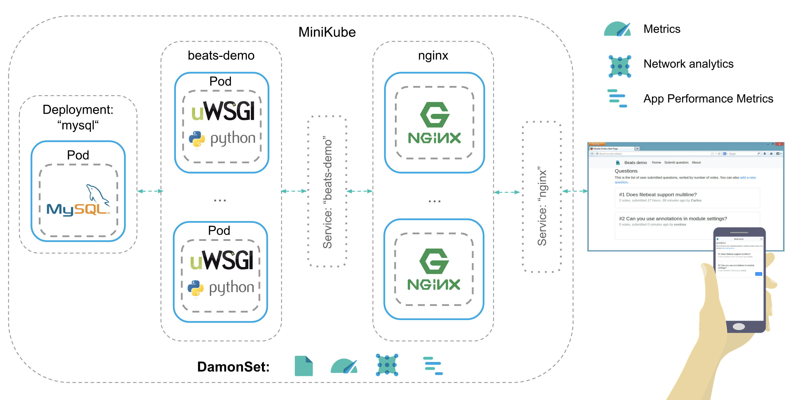
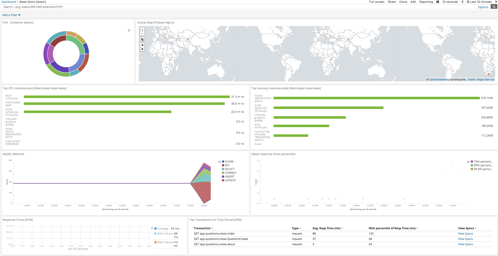
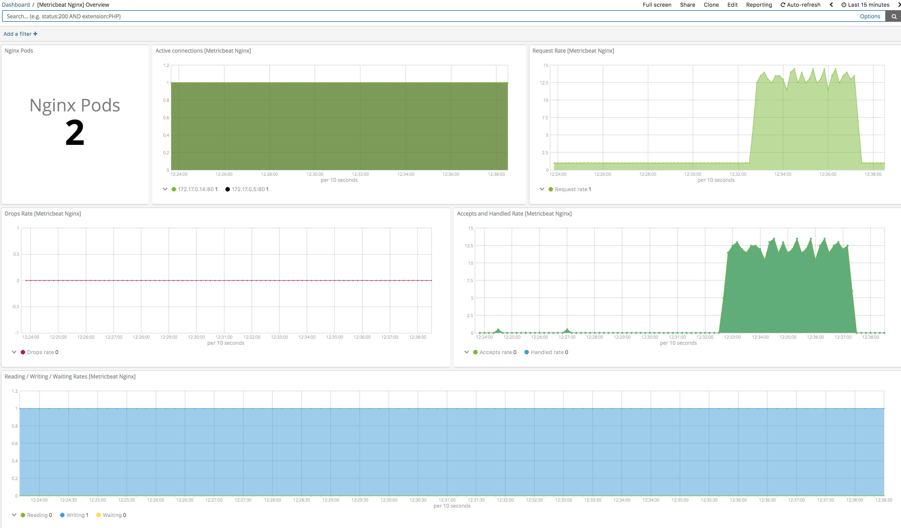

# Oberservable Kuberentes demo using Beats and APM

1. Install minikube
2. Change the secretes in the secretes.yaml file as needed. Make sure you change the IP address of the Elasticsearch host. It can be your local IP or the IP/hostname of your Elastic Cloud instance. Also, make sure your loacal instance is listening on all network interfaces instead of only "localhost". Remember to use the '-n' option during encoding
3. Deploy everyting using the following command: kubectl apply -f .

Note that you will have to set up an external Elasticsearch cluster for Beats and APM to talk to. I did not configure a stateful deployment inside Kubernetes. You can install locally on your laptop, or use an Elastic Cloud instance. Again, change the secretes accordingly.

Demo Architecture:
-----------------

Example Dashboard:
-----------------

